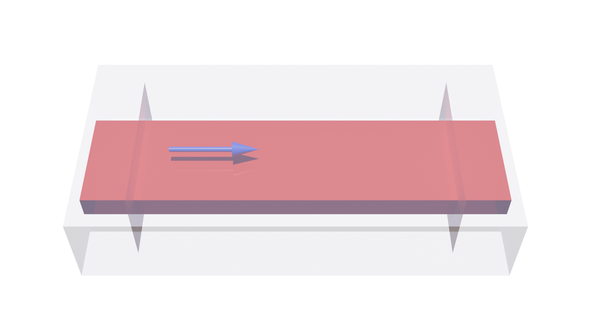
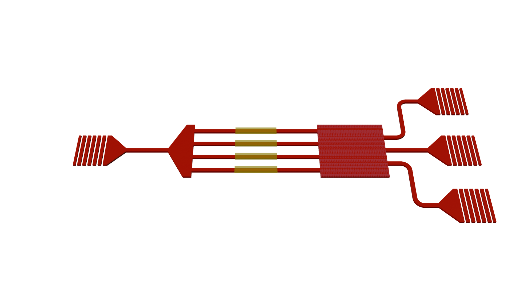

# blender-layout-render
A Blender modeling tool with a similar modeling method to [SPLayout](https://github.com/Hideousmon/SPLayout).

###  Dependency
* Blender 4.1

### Installation

```powershell
git clone https://github.com/Hideousmon/blender-layout-render.git
cd blender-layout-render
path-to-blender-python setup.py install
```

for example:

```powershell
S:/Blender/4.1/python/bin/python.exe setup.py install
```

### Usage

After installation, you can use it with the Python in Blender, for example:

```
S:/Blender/4.1/python/bin/python.exe waveguide_sim_scene.py
```

Otherwise, you can set this python as a system python in PyCharm and run it.

> Note: There is something wrong when use it in Blender scripting window.

### Examples

examples can be find in the [examples](https://github.com/Hideousmon/blender-layout-render/tree/main/examples) directory. 

#### Simulation Scene of a Waveguide

[waveguide_sim_scene.py](https://github.com/Hideousmon/blender-layout-render/blob/main/examples/waveguide_sim_scene.py)



#### Layout Schematic of an Integrated PhotSonics Device

[integration_layout_schematic.py](https://github.com/Hideousmon/blender-layout-render/blob/main/examples/integration_layout_schematic.py)



### TODO

1. better color matching.
2. more materials.
3. ...

Pull requests / issues are welcomed.
