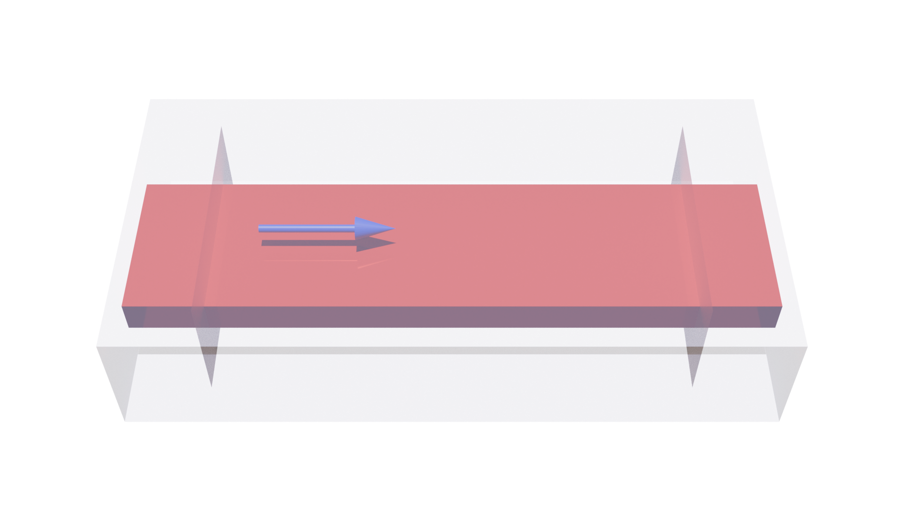
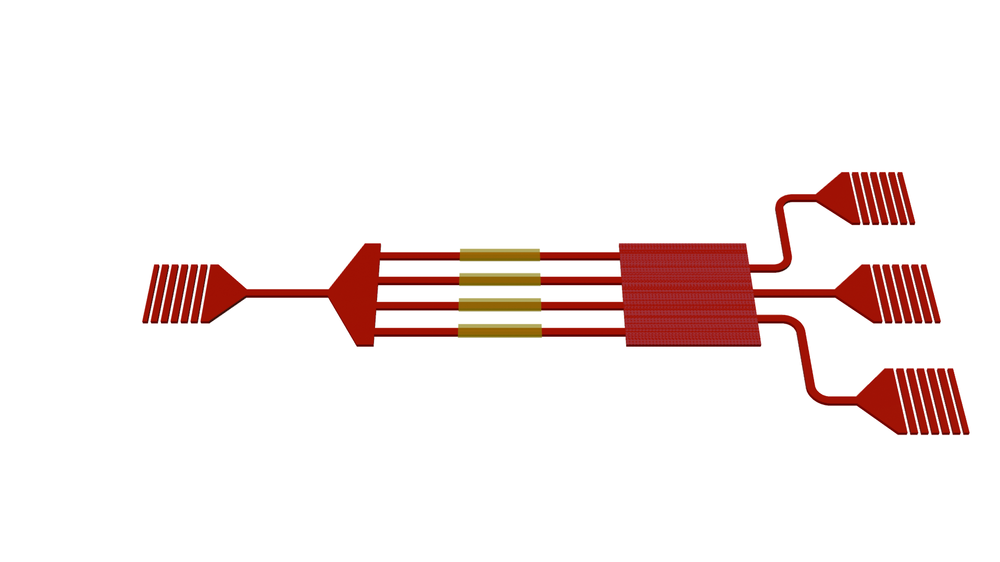

# blender-layout-render

A Blender modeling tool with a workflow similar to [SPLayout](https://github.com/Hideousmon/SPLayout).

## Dependencies

- Blender 4.1
- `bpy` (provided by Blender Python)
- `shapely`

## Installation

Clone this repository first:

```powershell
git clone https://github.com/Hideousmon/blender-layout-render.git
cd blender-layout-render
````

Install the package with Blender's Python:

```powershell
path-to-blender-python setup.py install
```

Example:

```powershell
S:/Blender/4.1/python/bin/python.exe setup.py install
```

## Install Python Dependencies

### bpy

`bpy` is included in Blender's Python environment, so you usually do not need to install it separately.
Please make sure you run this project with the Python executable that comes with Blender.

### shapely

Install `shapely` into Blender's Python environment:

```powershell
path-to-blender-python -m pip install shapely
```

Example:

```powershell
S:/Blender/4.1/python/bin/python.exe -m pip install shapely
```


## Usage

After installation, run scripts with Blender's Python, for example:

```powershell
S:/Blender/4.1/python/bin/python.exe waveguide_sim_scene.py
```

You can also set Blender's Python as the system/interpreter Python in PyCharm and run the scripts there.

> Note: There may be issues when running this project directly in Blender's scripting window.

## Examples

Examples can be found in the [examples](https://github.com/Hideousmon/blender-layout-render/tree/main/examples) directory.

### Simulation Scene of a Waveguide

[waveguide_sim_scene.py](https://github.com/Hideousmon/blender-layout-render/blob/main/examples/waveguide_sim_scene.py)



### Layout Schematic of an Integrated Photonics Device

[integration_layout_schematic.py](https://github.com/Hideousmon/blender-layout-render/blob/main/examples/integration_layout_schematic.py)



## TODO

1. Better color matching
2. More materials
3. ...

Pull requests and issues are welcome.
